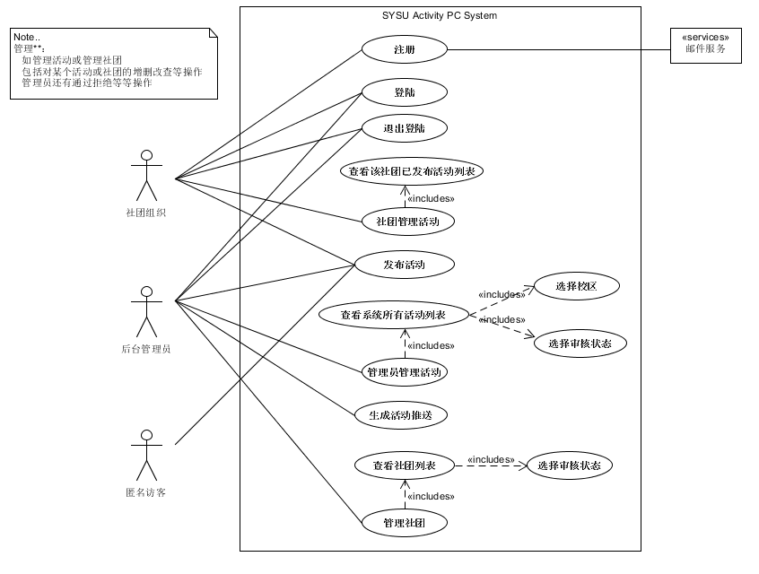
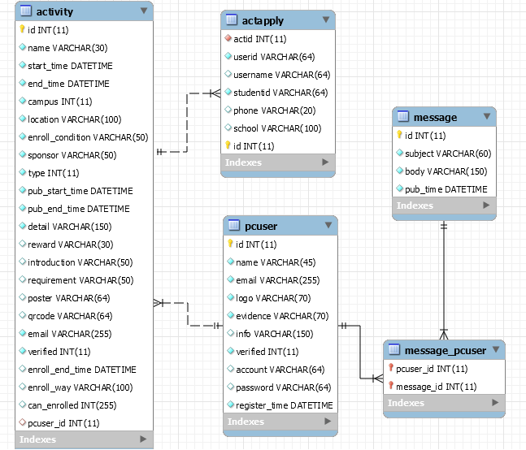
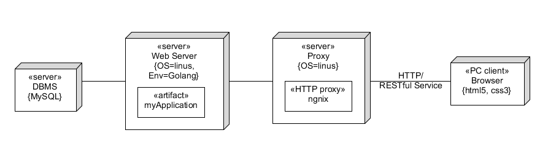
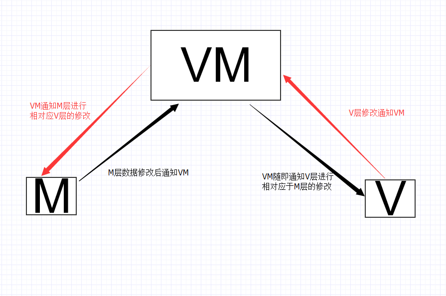
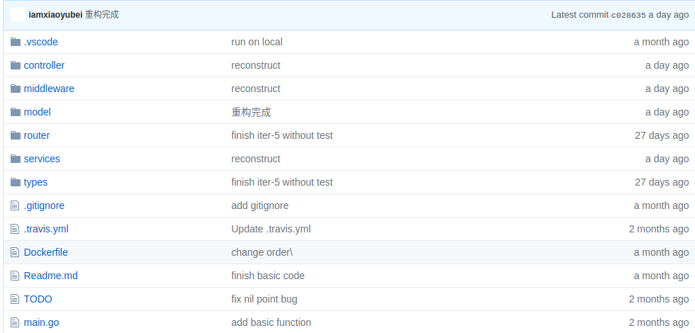

# 软件设计文档
**小组成员：肖雨蓓，唐玄昭，吴雪敏，朱理锋，李佳仕**

## 总体设计
### 设计流程--从关键模型一步步设计

我们使用的是敏捷开发方式，应用时间定量的迭代和进化式开发，使用自适应计划并增量交付。

我们的开发历时约两个半月，共五次迭代，从初始阶段，确定了大致的构想和范围；再之后的细化阶段，进行了核心架构的迭代实现，确定了大多数需求和范围，而由于我们的项目较为小型，所以，基本上细化和构造阶段并未严格分开；相当于我们每次迭代，都会进行需求分析，设计，实现，测试以及部署。

需求分析和API设计，数据库设计，技术文档等都在各自迭代的文件夹中含有，较为分散，所以在下面，我们会将其整合为几张重要的图制品，而并不是说我们从开发一开始就确定了需求等等，我们使用的并非瀑布模型。

同时在我们每一次迭代实现完成后，我们会进行本地测试，单元测试，服务端测试以及验收测试，本地测试即本地单元测试，覆盖了每次迭代的关键用例和关键代码，而本地测试通过后，部署到腾讯云上，进行服务端的单元测试，之后再由产品经理直接使用我们的产品进行本次的验收测试，每次测试出现的问题由相关人员在当次迭代中解决。

注意，下面的数据库设计和API设计以及后端中会提及到报名模块(actapply)以及消息模块(message)，不过还没有完全完成这两个模块的前端，因此我们在产品和用例图等设计图中会将这两个模块入口隐藏，由于时间原因，这部分的完成将是我们以后的工作，并非综合实训开发周期内的工作。

用例图：



ER图：




### 总体架构

我们的系统总体上使用了三层软件架构模式：表示层，业务层和持久层。表示层负责接收用户请求，转发请求和显示数据等；业务层负责组织业务逻辑；持久层负责持久化业务对象。

同时为了降低耦合以及减少编码工作之间的相互牵制，我们的项目使用了前后端分离的思想；前端工程师负责表示层，并且在表示层中使用了MVVM架构模式；而后端工程师负责业务层和持久层，即业务逻辑和数据库部分，在业务层中我们使用了事务脚本模式，但实际上我们将操作同一类的事件组合在一起形成了各个模块，而我们后端使用的GO语言并不支持类，虽然可以用struct代替类，但是我们将其各个事件函数分类打包成模块，其实也相当于一种领域模型架构模式；在持久层中，我们使用了数据映射器架构模式，通过数据映射器将关系数据库中的数据本身和处理业务逻辑的对象对应起来，有效地在领域模型中隐藏数据库操作并管理数据库转换中不可避免的冲突，从而消除了领域层和数据库操作之间的耦合。

``` txt
- 表示层（Presentation Layer）
    - 前端实现
    - MVVM架构模式
- 业务层（Business Layer）
    - 后端实现
    - 事务脚本模式/领域模型模式
- 持久化层（Persistent Layer）
    - 后端实现
    - 数据映射器架构模式
```

而在前后端之间，我们让后端提供RESTful API给前端，前后端通过遵循API的设计分别进行工作，因此只需要保证API文档的准确性和实时更新，那么前端和后端便能够相互独立地进行编码工作，从而有效地促进工作效率；同时我们在前后端之间增加了一个nginx服务器作为HTTP反向代理接收前端的请求，然后将请求转发给后端，并将从后端上得到的结果返回给前端，从而使得后端只需要去做逻辑计算，节约了等待时间去处理更多的请求，提高了后端的吞吐量从而增加了后端的效率。



其中在前端我们使用的是vue全家桶（vue + vue-router + iview ）+ axios + webpack技术栈，在后端我们使用的是nginx+golang技术栈，在Golang的许多开源包的辅助下实现了我们的RESTful API，同时在数据库上我们使用的是MySQL关系型数据库。

对于上面提及的不同层的识别以及各个层类的设计，我们使用了BCE模型进行详细设计的方法：

- Boundary：与外部 Actor 交互的类。包括 UI、外部系统接口
- Controller：处理外部事件，实现控制流的类。通常是一个子系统、一个用例一个类
- Entity：领域对象或数据实体

从而设计出了以下的详细三层架构模型图：


客户的整个交互：客户通过与前端页面进行交互，前端根据用户的操作通过ajax技术异步发送HTTP请求给后端，后端接收请求后，根据url分发到不同的controller进行处理，ORM框架将后端对象与数据库关系进行一一映射，后端controller操作model进行数据的改变，请求经过处理后，后端最后生成响应发送给前端，前端得到HTTP响应后，通过解析和浏览器渲染，将结果呈现给用户。


由于我们采用了前后端分离的思想，因此我们将项目划分为了两个子仓库：service-end和front-end，让前端和后端工程师分别管理自己的项目，进行开发工作。因此，我们接下来分别从前端和后端方面介绍技术选型，架构设计，模块划分以及使用到的软件设计技术。


## 前端
### 技术选型及理由 唐玄昭

本项目前端的技术栈为vue全家桶（vue + vue-router + iview ）+ axios + webpack

- vue： 当下最火最容易上手的MVVM框架
- vue-router: 前端路由
- axios：很强大很好上手的ajax请求库
- ivew: 一款vue的ui框架，精美好看
- webpack：打包工具

**选择这些技术的理由：**

**vue：**

vue是国人开发的一款MVVM框架。它的特点是轻量 ，好上手 。考虑到前端开发同学的技术栈参差不齐，所以统一选用vue来作为开发框架，因为它好上手，学习的曲线是很平滑的，不像react和angular这类MVVM框架学习成本较高。其次就是轻量，vue的作者给广大开发者提供了一个脚手架工具，能够一键生成项目，生成的项目里有vuex，有vue-router，也有eslint这类工具，做到了开箱即用。对比react，react的比较出名的脚手架工具没有vue-cli这么方便，它还得自己根据需求去添加别的第三方插件，而且添加的成本略高，需要去看英文文档和写一些引入代码。综合对比react和angular在这两点上的不同，最后选择了vue。


**vue-router：**

vue-router是配套vue的一个单页面路由的插件。单页面与传统的网页最大不一样的地方就是，传统网页的路由是有后台去控制的，而单页面网页的路由是放在前台的，在前台中控制。故vue-router是必选的


**axios：**

选用的原因很简单，就是简单和强大。简单在于可以一行代码就发起一个http请求，支持promise，所以也就可以使用async await来以同步的形式写异步的代码。

强大在于提供了拦截器等功能。方便我们在发起请求前在header增加token，以及在收到回复中，分析结果，统一处理错误。


**iview：**

一款相对其他vue的ui框架比较好的ui框架。而且还比较好看，故选用。


**webpack:**

webpack 是当下前端最流行的构建打包工具，利用 webpack 搭配相应的 loader，我们可以在前端项目中使用 es6 进行开发，效率更高。开发完成后，webpack 还可以帮我们完成构建，将代码编译到 es5 以兼容大部分浏览器。webpack 优化了构建打包的算法，优化前端的模块加载，使得构建打包后的产品代码体积更小。


### 架构设计

前端是整个系统中三层架构的表示层，在其中使用了MVVM的架构模式，vue就是这样的一个框架。



前端项目主要是页面样式开发，交互逻辑开发以及开发完后的部署。可分为开发环境和生产环境。而开发环境和生产环境都需要webpack来构建。webpack构建首先需要源代码，其次webpack是配置大于约定的，需要我们写配置文件去告诉它从哪个入口文件开始打包，打包哪种文件，如何打包等等，打包后还会生成一个可用于我们部署到服务器的文件。另外，由于前后端现在是分离的。前后端开发环境不一样，肯定会出现跨域等情况，又或者开发时，热更新可以帮助我们减少重复的操作等等，所以又需要额外的配置文件。故综合以上的分析，我们需要以下4个包

- build：根据config和执行环境来打包构建src中的代码，使其可运行，可调试
- config：项目的webpack打包配置、http代理配置
- src: 源码，平时开发写的代码都在这里
- dist：项目打包后生成的可部署文件


上面也说到我们的源码都在src里面。而一个可维护和可扩展的代码是需要做好文件架构的。根据单一职责原则，我们可以先把代码分割成 assets，router，utils，style和页面的UI和逻辑代码五个部分。

assets主要放一些资源，比如icon和图片。

router主要放前端的路由配置，这里指明了前端的页面的路由路径以及对应的组件。

style放了一些全局的样式和动画的样式，由于浏览器默认的标签样式不统一，为了让我们的网页在各个页面展示的效果一致，我们需要一个reset.css来统一标签的样式，也由于我们会用到一些比较好看的动画效果，有时候自己写比较麻烦，而已经有人做好了轮子，我们直接拿来用就是了，比如我们这次引用的animate.css。

utils就放了全局通用的方法，需要用到的话引入即可，不需要每个组件都写一份。

至于最后的页面UI和逻辑代码。我们这里采用了组件开发的思想，每个页面抽象为一个有很多组件组合而成的。我们需要把可复用的页面UI和逻辑抽象成为一个组件。那需要用到的页面直接使用就好。这样的思想，给我们带来了高复用，高内聚，低耦合的好处。故这部分又可以分为 components和pages两个部分。components就是可复用的组件。pages就是组装这些组件的代码。而且根据页面来命名文件，协作者一看到文件名就知道对应哪个页面，这样也提高了效率。

- components：可复用组件
- pages: 页面组件
- utils：公共工具函数
- style：公共样式、重置样式和动画样式
- assets：图标、图片等静态资源
- router：前端路由
  


### 模块划分

根据设计图和应用的业务逻辑，我们可以得到以下界面关系图。根据每个界面的业务逻辑关联度和操作上的关联度，可以大致将应用的所有界面划分到4个模块中，如下图中蓝色框所标识出的模块，以及顶部红色框所示登录注册模块。


按照界面划分好的情况，我们可以将组件包 components 细分为4大模块，将每个界面组件根据上面的划分情况放到相应的模块中进行管理。接着继续细分其他包，通用包可以划分为 style 和 utils，项目中有公共样式和公共工具函数，其他的公共内容几乎没有，因此这里只划分了两个模块（公共组件一般可以直接引用 UI 框架的组件）。router 只提供路由配置和控制功能，不需要再继续划分。

最后，综合考虑使用的技术框架，并根据应用需要的页面组件，我们可以完善得到详细的项目结构如下所示。后续的开发可以明确地进行分工，每个人负责不同的模块，然后进入到相应的包里面进行开发即可。顶层的模块如果需要修改配置或者更新内容，由项目负责人与成员商定后进行修改即可，做好顶层配置后，可以很好地解耦各模块，使得项目能够顺利、快速地完成开发。如果过需要新增界面、功能，引入新组件，也可以很方便地将新内容添加到项目中去。

```txt
├─build：存放构建用到的相关文件
├─config：存放配置文件
├─src：前端开发的源码
│   ├─assets：图片等静态资源
│   ├─common：公共样式或js文件
│   │    ├─css：字体和图标文件
│   │    │  ├─font.css：字体文件
│   │    │  └─icon.css：图标文件
│   │    ├─sass：公共样式文件
│   │    └─utils：公共工具函数库
│   │       ├─DateUtils.js：处理时间日期的工具函数
│   │       ├─Form.js：表单工具函数
│   │       └─LazyLoad.js：实现图片懒加载
│   ├─components：前端通用组件
│   │    ├─avatar：头像展示组件
│   │    ├─bigCard：浮层卡片组件
│   │    ├─breadcrumbNav：面包屑导航组件
│   │    ├─button：按钮组件
│   │    ├─footer：页面底栏组件
│   │    ├─header：页面顶栏组件
│   │    ├─listItem：列表项组件
│   │    ├─publishForm：发布活动表格组件
│   │    ├─selectForm：活动额外信息填充组件
│   │    ├─status：活动状态组件
│   │    └─steps：活动审核步骤组件
│   ├─pages：前端页面模块
│   │    ├─admin：管理员模块
│   │    |   ├─communityManage：社团管理
│   │    |   |    ├─application：社团注册审核
|   |    |   |    └─notice：社团通知
│   │    |   ├─dataManage：活动管理
│   │    |   |    ├─activityManage：审核通过活动列表
│   │    |   |    ├─activityReview：待审核活动列表
|   |    |   |    └─collection：活动推送模板生成
│   │    |   └─publish：活动发布
│   │    ├─community：社团模块
│   │    |   ├─activityManage：活动管理
│   │    |   ├─home：系统通知管理
│   │    |   └─publish：活动发布
│   │    ├─tourist：游客模块
│   │    |   └─publish：活动发布
│   │    ├─login：登录模块
│   │    └─regist：注册模块
│   ├─router：前端路由
│   │    └─index.js：前端路由信息配置文件
│   ├─style：应用的全局样式
│   │    ├─animate：动画样式
│   │    ├─common：全局通用样式
│   │    └─reset：整体元素样式重置
│   ├─utils：全局通用工具函数
│   │    ├─index：功能性函数
│   │    └─validate：表单输入验证函数
│   ├─App.vue：应用的最外层结构
│   └─main.js：应用的入口文件；第三方组件和公共文件在此引入
└─docs：项目用到的文档，如后端接口文档
```

### 软件设计技术

* 面向对象编程：应用中使用了面向对象编程的封装思想，按照业务逻辑将代码的各个模块进行了封装，最明显的地方就是 router 和 utils。router 封装了路由配置信息，在界面的业务逻辑代码中通过 $router 对象可以控制界面跳转，通过$route对象可以实现路由间信息传递。而 utils 则是封装了公共工具函数。代码对应的模块分别为 router、utils。
* 代理模式：前端所访问的服务器是一个 NodeJS 服务器，但我们的 API 却都是 Go 服务器所提供。在这里，为了便于本地的调试，我们用NodeJS 服务器做了一层中间代理，使得前端可以访问到 Go 服务器的 API。但前端并不知道 Go 服务器的存在。由于这层中间代理的存在，使得前端无需考虑跨域问题就能调用后台 Go 服务器的接口。对应的代码为 build/dev-server.js 和 config/index.js。
* 发布订阅模式：应用的数据变化会自动影响到引用了该数据的界面，促使界面发生更新，主要使用的设计模式即发布订阅模式。这部分由 Vue 框架本身实现。

## 后端
### 技术选型及理由

后端的技术栈为nginx+golang+mysql+gorilla/mux+xorm

golang是一门编程语言，其内置了web支持，其优势在于性能高，学习周期短，开发成本低，专一化，轻量化，考虑到各种语言的熟悉程度和部署成本，我们决定使用golang作为我们的后台开发语言；同时，golang语言不需要类似java spring这类后台语言繁重的框架，只需要编译即可作为服务器运行，给容器化提供了很大的方便；除此之外，golang的开发效率与python相当，但运行效率却远远超过python，从而节约了资源成本

Nginx 是一个高性能的负载均衡服务器，支持负载均衡；能够快速灵活且可靠的传送静态文件，同时能保证网站在面对恶意流量的攻击中能正常运行，从而保护应用安全。该项目使用nginx作为反向代理工具，使得后台的编码无需考虑繁复的路径问题，同时提供给后台良好的可扩展性。

MySQL 是目前最流行的关系型数据库管理系统，被广泛地应用在 Internet 上的中小型网站中，它具有体积小、速度快、总体拥有成本低，且其免费开源。此次开发使用关系型数据库作为用户信息和活动信息的存储载体。

gorilla/mux 是一个强大的路由，小巧但是稳定高效，不仅可以支持正则路由还可以按照Method，header，host等信息匹配，可以从我们设定的路由表达式中提取出参数，从而方便上层应用，而且完全兼容http.ServerMux。从而可以较好地实现RESTful API服务。

xorm 是一个简单而强大的Go语言ORM库，利用反射技术完成了数据库对象的管理，编程时不需要再去考虑sql语句的构造，从而使数据库操作异常简便， 因此与数据库交互的部分我们使用了xorm。

### 架构设计

后端架构设计主要包括后端架构设计和后端框架应用，其中后端框架的选择在技术选型及理由中已经列出，因此在这里，我们将结合我们项目的实际描述一下我们的架构：

后端实现的是整个系统三层架构中的业务层和持久化层，在业务层中我们使用了事务脚本模式，但实际上我们将操作同一类的事件组合在一起形成了各个模块，而我们后端使用的GO语言并不支持类，虽然可以用struct代替类，但是我们将其各个事件函数分类打包成模块，其实也相当于一种领域模型架构模式；在持久层中，我们使用了数据映射器架构模式，通过数据映射器将关系数据库中的数据本身和处理业务逻辑的对象对应起来，有效地在领域模型中隐藏数据库操作并管理数据库转换中不可避免的冲突，从而消除了领域层和数据库操作之间的耦合。

我所说的领域模型模式实际上就是将事件分成了模块：活动报名子系统(actapply)，消息管理子系统(message)，session管理子系统，用户管理子系统(pcuser)，图片管理子系统(image)，活动管理子系统(activity)。

而对于持久化层，也将其按照领域对象/数据实体进行了分模块：活动报名实体，活动实体，消息实体和PC用户实体。

```txt
Controller：处理外部事件，实现控制流的类。通常是一个子系统、一个用例一个类
Entity：领域对象或数据实体
```

三层框架对应项目框架包图：


其次在我们的项目中，API设计和数据库设计主要由后端进行设计决定，因此在后面进行说明。

#### 数据库设计

我们在总体架构中，一步一步从领域模型设计到ER图，其实就已经得到了我们的数据库表和之间的关系，下面是我们最终的数据库图：


对于社团用户和管理员，我们直接通过pcuser的name和id进行区分，因为我们规定仅有一个管理员账户，因此没有必要为管理员账号新开一张表，同时我们将pcuser与activity设置为1对多的关系，符合现实意义即一个用户可以发布多个活动。我们使用了message_pcuser来存储pcuser和message的id对，因为message和pcuser是多对多的关系，一个消息可以被发送给多个用户，一个用户也可以接收多个不同的消息。

因此，以上数据库是合理且符合现实意义的。


#### API设计

我们的API设计是遵循RESTful API的风格，并且使用apiary.io平台实现API的共享协作和测试，我们根据API处理的资源不同对其进行了模块的划分：
- ActApply模块
- Message模块
- Session模块
- PCUser模块
- Picture模块
- Activity模块

API模块截图如下：


以Session模块接口为例，如下图，每个接口的参数以及类型说明都一目了然，接口中未说明清晰的地方还会在每次迭代中用技术文档说明，大大提高了开发和前后端对接效率。 


### 模块划分

后端开发主要包括API的开发以及权限访问控制等功能的实现，同时我们进行BCE模型详细设计时也进行了分类，因此我们后端可以划分为路由器模块，业务层模块(controller)，持久化模块(model)，中间件模块，类型处理模块，服务函数模块；其中业务模块又可以划分为活动报名模块(actapply)，消息模块(message)，session模块，用户模块(pcuser)，图片模块(image)，活动模块(activity)；持久化模块分为活动报名Dao模块，活动Dao模块，消息Dao模块，PC用户Dao模块，以及ORM实体模块和数据库初始化模块，因此可以看到模块划分十分清晰，便于管理和工作。

服务端目录结构如下：

```txt
├─Dockerfile：存放docker配置文件
├─main.go：主函数入口
├─controller：业务层模块
│   ├─actapply.go：活动报名模块
│   ├─activity.go：活动模块
│   ├─image.go：图片模块
│   ├─message.go：消息模块
│   ├─pcuser.go：用户模块
│   ├─session.go：登陆模块
├─middlerware：权限管理中间件模块
├─model：持久化层模块
│   ├─actapplyDao.go：actapply entity的CURD操作
│   ├─activityDao.go：activity entity的CURD操作
│   ├─messageDao.go：message entity的CURD操作
│   ├─pcuserDao.go：pcuser entity的CURD操作
│   ├─entities.go：ORM实体
│   ├─init.go：数据库初始化模块
├─router：路由器模块
├─services：服务函数模块
└─types：类型处理模块
```

### 软件设计技术 唐玄昭

**OOP**：使用golang作为后台语言，利用领域模型建模，将需要用到的实体使用结构体的方式进行封装，并给予相应的属性和方法，以数据库对象Activity为例：


以上两张图分别包含了Activity这么一个类所具有的属性值和方法，外部可以通过调用方法来实现对数据库的修改

**3-tier architecture**：考虑到扩展性和可维护性，我们将后台分成表示层-业务逻辑层-持久化层，分别负责请求信息的读取及返回值的封装、业务逻辑的处理、数据库等持久化对象的处理，三者各司其职，每一层只对上一层提供服务，同样的，每一层也只能调用其下一层的服务，从而降低了系统的耦合性；而业务逻辑层基本上只会使用一个数据库对象进行数据操作，因此达到了高内聚的要求；

由于采用前后端分离，因此后台实际上并没有表示层这一说，这里所说的表示层其实是和业务逻辑层合在一起的，用来解析参数的，实际的架构中并不存在，业务逻辑层负责处理业务问题，主要就是根据接口和用户传递的参数，对事务进行管理以及调用下层提供的功能，对持久化数据进行修改；

持久化层负责对持久化数据进行管理，不涉及具体业务，只对外提供方法



**可扩展性**：对于后台系统来说，系统不关心用户之前访问了什么，所有的状态信息都包括在了当前的请求之内，从而为系统的可扩展性带来了方便；使用先进的容器技术，将后台打包进容器中，单主机需要扩展时，直接在compose中设置镜像的实例数便可完成；多台机器构成的集群需要扩展时，同样可以使用machine提供的便利性，将多台机器看成一个整体，由docker进行管理。后台系统之前存在一个nginx网关，负责请求的分发和静态文件的代理，当存在有多个后台进程时，nginx又可以作为负载均衡使用


## 测试 唐玄昭