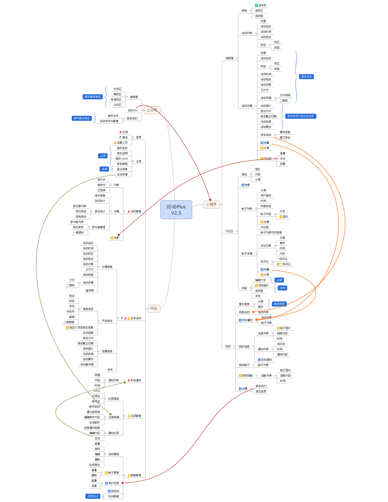

## 课程要求
**时间进度：**
1. 完成组队并提交软件设计题目 4月30日
2. 持续提交软件工程制品
3. 提交最终制品 6月下旬，时间待定
4. 展示答辩 待定

**课程考核：**根据Github中的Issue分派和Git提交记录，确定工作贡献

**最终结果：**
1. 《使用说明》
2. 所有源代码
3. 《软件需求规格说明书》SRS
4. 《软件设计文档》SDS 重点！！！
5. 《小组分工与贡献率说明》
6. 关键模型：用例图，Domain Model或ER图，架构图

**展示**
1. 展示软件
2. 基于《软件设计文档》，讲解说明软件设计思想
3. 答辩

## 我们的安排
### 总体任务清单
1. 完成“最终结果”中课程要求的文档；
2. 按照课程要求规范开发，进行开发；

### 阶段安排
阶段 | 时间 | 任务
---|---|----
开发迭代阶段 | now->6.14 | 每次迭代开发都有需求，设计和代码实现测试阶段，在每一迭代需完成相应的关键模型文档（用例图，Domain Model或ER图，架构图）以及需求文档
资料攥写准备展示阶段 | 6.14->6.21 | 迭代过程中的文档汇总整理成最终的需求文档以及攥写设计文档，以及完成其余的文档，攥写PPT准备展示

### 开发任务(基本模块)

阶段 | 模块 | 时长(截止时间)
---|---|---
第一次迭代 | 发布活动 | 一周(5.3)
第二次迭代 | 数据管理中的活动管理(运营人员) | 一周半(5.13)
第三次迭代 | 登录注册(社团用户)，之前直接给定管理员用户名密码 | 一周(5.20)
第四次迭代 | 社团管理(运营人员) | 两周(6.3)
第五次迭代 | 活动管理(社团) | 一周半(6.14)

**说明：**
- 每一次迭代结束开一个总结和下一步安排会议，时间按照实际情况灵活调整，任务会安排在github的issue上，任务按产品，前后端分配
- issue中任务细节需内部自行安排人员完成（在每次总任务分派后需快速确定分工），比如，后端分到完成发布活动任务，则某个接口由某某完成这些由内部自行分配并且需要在issue上详细展示出来
- 每次迭代最后两天进行代码的整合汇总，即在最后两天之前需完成相应的代码及测试
- 第一次迭代任务我会私戳给相应的人
- 前后端使用apiary进行api的交接，后端设计人员会在需求完成后设计接口
- 使用集成开发以及docker容器进行相应的开发
