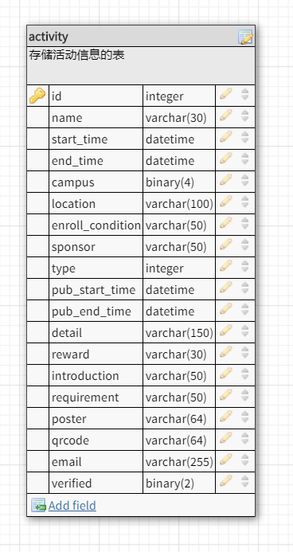

# 软件技术说明文档

## 接口参数说明

### Activity Collection [/act]

#### GET /act?page={pageNum} [该API无需PC后端人员完成]

根据指定前端所需的活动列表的页码数返回获得活动列表，默认每页最多为10个活动

##### Request

- pageNum

  按照需求文档说明，这个参数指定了前端所需的活动列表的页码数，默认每页最多为10个活动，例如：当前端进入活动列表页面时，此时需要第一页的数据，而当前端上拉到需要加载下一页时，则需要像后台发出pageNum为2的请求

##### Response

- content

  json数组，用以存储后台根据前端页码查询到的所有活动列表及相关信息，以下为具体字段内容

  - id

    活动id号，用以唯一地标记某一个活动

  - name

    活动名称

  - startTime

    毫秒时间表示的活动起始时间

  - endTime

    毫秒时间表示的活动结束时间

  - campus

    活动面向的校区，采用二进制方式编码，最后四位分别代表东、南、北、珠，例如：0b0001代表珠海校区。需要注意的是，这里可能不止一位为1，即活动面向的校区可能不止一个

  - type

    活动类型，具体参见下方给出的对应表(暂时还没有完成)

  - poster

  活动的海报名称，所有海报图片将会被取64位摘要后存储

  - location

  活动举办的详细地址

##### Response HTTP code说明 [待补充]
- 200 成功
- 204 目前无活动

#### GET /act/{id} [该API无需PC后端人员完成]
返回某个活动的详细信息，Response json field 详情请见数据库的表头说明

##### Response HTTP code说明 [待补充]
- 200 成功
- 204 无该活动

#### POST /act/{actId}
修改某个活动的详细信息

##### Parameters
- actId 需要修改的活动信息的那个活动id

##### Request
- json串: 详细属性请看数据库表头说明，格式请看apiary.apib

##### Response HTTP code说明 [待补充]
- 200 成功
- 400 错误

#### DELETE /act/{actId}
删除某个活动

##### Parameters
- actId 需要修改的活动信息的那个活动id

##### Response HTTP code说明 [待补充]
- 200 成功
- 204 无该活动

#### PUT /act?act={actId}&verify={verified}
通过或者拒绝某个活动审核

##### Parameters
- actId 需要修改的活动信息的那个活动id
- verified 通过还是拒绝该活动的审核：int类型 0->拒绝，1->通过

##### Response HTTP code说明 [待补充]
- 200 成功
- 204 无该活动

## 数据库表头说明

- id

  活动id号，用以唯一地标记某一个活动

- name

  活动名称

- start_time

  毫秒时间表示的活动起始时间

- end_time

  毫秒时间表示的活动结束时间

- campus

  活动面向的校区，采用二进制方式编码，最后四位分别代表东、南、北、珠，例如：0b0001代表珠海校区。需要注意的是，这里可能不止一位为1，即活动面向的校区可能不止一个，前端传相应的二进制对应的整数给后端即可

- location

  活动举办的详细地址

- enroll_condition

  报名条件

- sponsor

  (TODO)

- type

  活动类型，具体参见下方给出的对应表(暂时还没有完成)

- pub_start_time

  开始展示的时间

- pub_end_time

  结束展示的时间

- detail

  活动详细信息

- reward

  活动的奖励

- introduction

  活动的简介

- requirement

  参加活动的要求，可以理解为面向群体

- poster

  活动的海报名称，所有海报图片将会被取64位摘要后存储

- qrcode

  二维码地址，具体存储方式和海报相同

- email

  发布方邮箱
