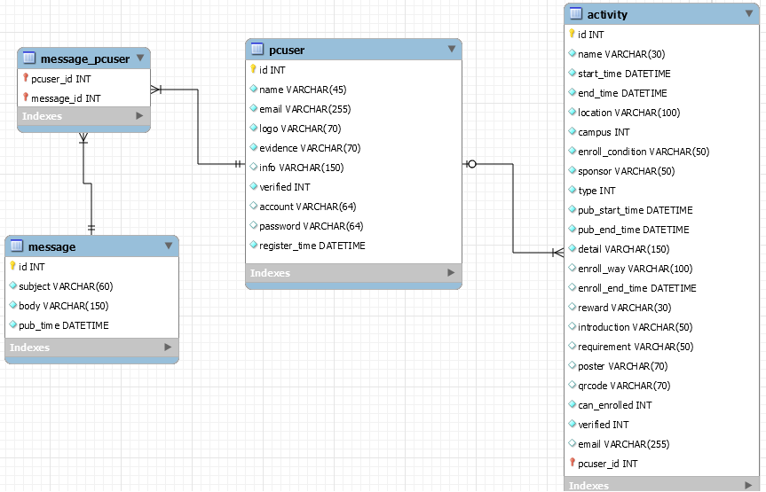

# 软件技术说明文档

## 接口参数说明

### Activity Collection [/act]

#### GET /act?page={pageNum}&verify={verified}

根据指定前端所需的活动列表的页码数返回获得活动列表，同时verified用来限定返回的是审核通过的活动的活动列表还是暂未审核的活动的活动列表，默认每页最多为10个活动

##### Request

- pageNum

  按照需求文档说明，这个参数指定了前端所需的活动列表的页码数，默认每页最多为10个活动，例如：当前端进入活动列表页面时，此时需要第一页的数据，而当前端上拉到需要加载下一页时，则需要向后台发出pageNum为2的请求
  
- verified
  指定该活动的状态是通过审核的状态还是等待审核的状态：int类型 0->等待审核，1->通过

##### Response

- content

  json数组，用以存储后台根据前端页码查询到的所有活动列表及相关信息，以下为具体字段内容

  - id

    活动id号，用以唯一地标记某一个活动

  - name

    活动名称

  - startTime

    毫秒时间表示的活动起始时间

  - endTime

    毫秒时间表示的活动结束时间

  - campus

    活动面向的校区，采用二进制方式编码，最后四位分别代表东、南、北、珠，例如：0b0001代表珠海校区。需要注意的是，这里可能不止一位为1，即活动面向的校区可能不止一个

  - enrollCondition

    报名条件

  - sponsor

    发布活动的主办方

  - pubStartTime

    开始展示的时间

  - pubEndTime

    结束展示的时间
    
  - verified
    
    指定该活动的状态：int类型 0->等待审核，1->通过，2->被拒绝通过

##### Response HTTP code说明 [待补充]
- 200 成功
- 204 目前无活动

#### GET /act/{id}
- 此处与小程序后台API不同的是无论活动审核通过与否，均需要返回活动的活动详情
- 返回某个活动的详细信息，Response json field 解释请见数据库的表头说明

##### Response HTTP code说明 [待补充]
- 200 成功
- 204 无该活动

#### POST /act/{actId}
修改某个活动的详细信息

##### Parameters
- actId 需要修改的活动信息的那个活动id

##### Request
- json串: 详细属性请看数据库表头说明，格式请看apiary.apib

##### Response HTTP code说明 [待补充]
- 200 成功
- 400 错误

#### DELETE /act/{actId}
删除某个活动

##### Parameters
- actId 需要修改的活动信息的那个活动id

##### Response HTTP code说明 [待补充]
- 200 成功
- 204 无该活动

#### PUT /act?act={actId}&verify={verified}
通过或者拒绝某个活动审核

##### Parameters
- actId 需要修改的活动信息的那个活动id
- verified 通过还是拒绝该活动的审核：int类型 0->拒绝，1->通过

##### Response HTTP code说明 [待补充]
- 200 成功
- 204 无该活动

## 数据库表头说明

- **关于数据表内字段是否为空以及初始值等请查看document根目录下的ermodel，使用workbench打开即可，可以在数据库中使用生成表格的SQL**
- id

  活动id号，用以唯一地标记某一个活动

- name

  活动名称

- start_time

  活动起始时间

- end_time

  活动结束时间

- location

  活动举办的详细地址

- campus

  活动面向的校区，使用二进制理解，最后四位分别代表东、南、北、珠，例如：0b0001代表珠海校区。需要注意的是，这里可能不止一位为1，即活动面向的校区可能不止一个，前端传相应的二进制对应的整数给后端即可

- enroll_condition

  报名条件

- sponsor

  主办方，默认为登陆的社团的name

- type

  活动类型：0->公益，1->体育，2->比赛，3->讲座，默认为0

- pub_start_time

  宣传开始时间 即开始展示在中大活动的时间

- pub_end_time

  宣传结束时间 即在中大活动结束宣传的时间

- detail

  活动详细信息

- enroll_way
  
  报名方式即中大的同学可以通过什么方式报名该活动

- enroll_end_time

  报名截止日期

- reward

  活动的奖励

- introduction

  活动的简介

- requirement

  参加活动的要求，可以理解为面向群体

- poster

  活动的海报存储的文件名

- qrcode

  二维码存储的文件名

- can_enrolled
  
  该活动是否开启报名，0代表未开启，1代表开启，默认为0

- verified
  
  该活动是否通过审核，0代表未通过，1代表通过，默认为0，2代表拒绝

- email

  用于匿名发布的邮箱填写

- pcuser_id

  这是一个外键，指向pcuser表的id，关系是pcuser可以发布多个活动，pcuser和activity通过id相联系，匿名发布时为空
