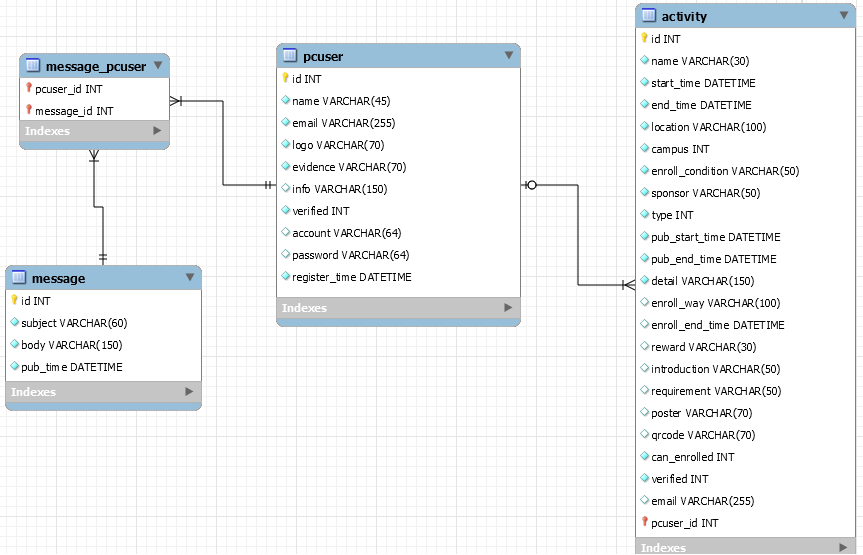

## 数据库说明
- pcuser表增加一个申请时间字段 register_time
- 同时需要注意在用户注册的时候，记录下register_time
- 增加两个新表message和message_pcuser
- 具体请看er_model.mwb文件，数据表如图：

## API说明
以下API均为管理员权限的API，header中均加入了token。

## 注册申请
### 社团管理和注册申请的社团列表API：PC User List
- 参数中的type参数：type==0时返回社团管理的社团列表(仅含已审核社团列表)，type==1时返回注册申请列表(含有待审核和已拒绝活动列表)
- 后端注意：【已通过审核】的社团列表按处理的时间先后顺序排列，注册申请的社团列表先排列【待审核】列表（按照申请的时间先后顺序），之后排列【已拒绝】列表（按照处理的时间先后顺序）

### 审核注册API（包括通过和拒绝）：Audit PC User By Manager
- 【通过注册】后端需将该社团对应的账号密码发送至联系邮箱。点击【拒绝】后端将审核状态设置为不通过，并且将body中传来的拒绝信息通过邮件发送给联系邮箱
- 若社团被通过注册，账号默认为该社团的联系邮箱，后端数据库中联系邮箱需设置为unique，**邮箱不能够存在重复的情况在提交时注册时就需要进行检查**
- 密码为随机生成的数字和字母混合的12位字符密码
- 前端需注意需求文档中的UI图，其中用户点击拒绝某社团时，需要有弹框填写拒绝的信息并发送
- 参数verified如果为1表示审核通过，如果为2表示拒绝，后端收到后注意修改verified
- 异步邮件发送：使用rebbitmq，利用消息队列完成异步方式的邮件发送，新增一个项目，用来作为消息队列的接收和处理，服务端收到请求，则发送消息到消息队列，完成后立即返回请求，减少等待时间 (玄昭确认)

## 查看社团信息
### 社团信息以及注册详情页面API:Get detailed PC User information
- 根据id返回社团的详情（无论审核是什么状态都返回信息），前端在社团信息和注册详情页面上取相应的返回属性显示即可

## 通知社团
### 发送通知社团API：Publish a New Message
- 通知社团的页面中【通知对象】选项，**前端需可以下拉选择已通过注册审核的社团名字列表**
- 发送通知后，后端先创建message的记录，再创建相应的message_pcuser关系表的记录，同时后端需要记录下发布通知的时间在pub_time中
- 其中"pcuserId": [1,2,3]为发送通知的社团id列表

### 查看通知列表API：List required messages 
- 查看通知列表
- "sendTo": ["clubname1","clubname2","clubname3"] 为通知的社团名称列表

### 删除通知API：Delete Message By Manager 
- 删除某条通知

### 查看通知详情API：Get detailed message information
- 查看通知的详情
