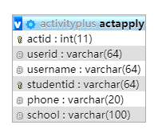

# 数据库变化
- 增加了actApply数据表格
- activity表格中can_enrolled，增加了一个2表示结束报名，之前有0代表未开启报名，1代表开启报名，默认为0

# API说明
## List required activities By Club
返回指定clubId的社团发布的活动的列表，同时需要检查该API的token，校验确认是否为clubId这个社团，仅token与clubId相对应才能够通过权限拿到本社团的活动列表
- **参数**： clubId：指定社团id
- **权限**： 仅社团可访问，并且仅token与clubId相对应才能够通过权限拿到本社团的活动列表，即只能够社团访问，并且解析token，从数据库中查询id，并且与clubId进行比对
- **前端注意**：
    - type为所属类别，0：审核中，1：进行中，2：已结束
    - canEnrolled代表是否开启报名，0代表未开启报名，1代表开启报名，2表示报名已结束
- **后端注意**：
    - 浏览数pageViews：小程序中该活动的浏览量，对进行中和已结束的类别活动有效，通过调用小程序API，获取该活动的小程序页面的浏览数返回
    - 报名数registerNum：针对开启报名功能的活动有效即can_enrolled为真的活动，计算该活动当前报名人数
    - type并非activity表中的那个type，而是所属类别（包括审核中，进行中，已结束），审核中和其他可通过verified进行区别，进行中和已结束通过pubEndTime与当前时间进行比较，若pubEndTime> currentTime则为进行中，若pubEndTime< currentTime则为已结束
    - type代表意思：0：审核中，1：进行中，2：已结束
    - 按发布时间先后进行排序

## Get detailed activity information
第三次迭代中已实现，前端直接调用即可

## Modify Activity Info By Manager or Club
第三次迭代中已实现，但这次迭代需要进行部分修改，**管理员和社团都可以通过该API修改活动信息**，但是这次，对于社团权限，需要检查对应修改的活动是否为本社团发布的活动，仅本社团发布的活动才能够被该社团修改，否则没有权限401
- **后端注意**
    - 这次该API仅需要修改权限，对于社团权限，需要检查对应修改的活动是否为本社团发布的活动，仅本社团发布的活动才能够被该社团修改，否则没有权限401
    - POST参数中有actId，然后通过解析token，去数据库中得到该用户id，再通过查询该用户发布的活动中是否有该actId活动即可检查

## Get The number of Activity Status By Club
需求文档中说到的“鼠标移动到图7-1的 【活动管理】卡片时呈现活动状态的悬浮效果：如图7-2，展示【审核中】【进行中】的活动个数：1个活动正在审核中，3个活动正在进行中”
- **权限**： 仅社团可访问，并且仅token与clubId相对应才能够通过权限拿到本社团的活动列表，即只能够社团访问，并且解析token，从数据库中查询id，并且与clubId进行比对
- **返回参数说明**
    - auditNum：正在审核中活动数量
    - ongoingNum：正在进行中活动数量
    - overNum：已结束活动数量

## List required actApply
返回某个活动的报名列表
- **权限**： 仅社团可访问，并且需要检查活动actId是否为本社团发布的活动，仅本社团发布的活动才能够通过权限，否则没有权限401
- **返回参数注意**：
    - tableTitle为报名表格的几个选项的title，因为报名表格选项是可选的，并且可以自定义添加，因此有tableTitle这样的一个json数组，前端需动态生成这些选项的表格
    - content list中每个json对象中依次为tableTitle中相对应的选项，除了id是返回给前端进行其他操作的
- **前端注意**：
    - 需求文档中，“序号”考虑到会带来前后端不必要的麻烦，因此删除这一列，无需序号这一选项显示
    - 注意返回的id是不显示的
- **后端注意**：目前后端先固定生成这几个选项，目前还没有做可选，报名也涉及到小程序，因此先按照固定生成这几个选项，返回相应的信息即可，还有报名id和报名填写时间等等，待与小程序商议再添加

## Delete ActApply By Club
社团删除某个活动的某条报名
- **权限**： 仅社团可访问，并且需要检查活动actId是否为本社团发布的活动，仅本社团发布的活动才能够通过权限，否则没有权限401
- **前端注意**：删除操作要二次确认

## Close Activity Apply By Club
社团结束某个活动的报名
- **权限**： 仅社团可访问，并且需要检查活动actId是否为本社团发布的活动，仅本社团发布的活动才能够通过权限，否则没有权限401
- **后端**：
    - activity表格中can_enrolled修改为2表示结束报名

## 导出名单
由前端实现从table中导出excel表格

参考：

https://www.haorooms.com/post/js_excel

https://stackoverflow.com/questions/22317951/export-html-table-data-to-excel-using-javascript-jquery-is-not-working-properl

也可以直接调用插件：

jquery的插件table2excel：https://www.jqueryscript.net/table/Export-Html-Table-To-Excel-Spreadsheet-using-jQuery-table2excel.html